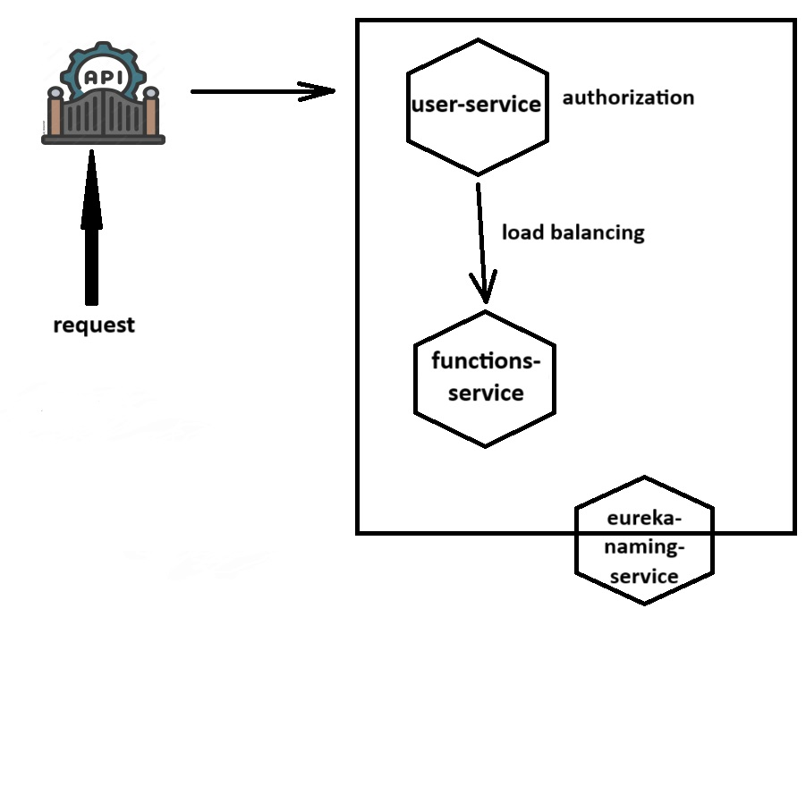

# Информация о кластере <h1>
## Схема кластера <h2>

### api-gateway <h3>
Запрос приходит на api-gateway, который в свою очередь перенаправляет его на user-service.
### user-service <h3>
Выполяет авторизацию, перенаправляет запросы на functions-service.
### functions-service <h3>
Предоставляет бизнес логику кластера. Не поддерживает прямой доступ. Доступ разрешен только через user-service.